# 📍 Documentation Site Map

**Visual Guide to All Documentation**  
Last Updated: October 27, 2025

---

## 🗺️ **Complete Site Map**

```mermaid
graph TB
    ROOT["📚 Documentation Root"]
    
    ROOT --> README["README.md<br/>Main Entry Point"]
    ROOT --> QUICKSTART["QUICKSTART.md<br/>5-Min Guide"]
    ROOT --> SITEMAP["SITEMAP.md<br/>This File"]
    ROOT --> CONVENTIONS["CONVENTIONS.md<br/>Standards"]
    
    ROOT --> ARCH["🏗️ ARCHITECTURE"]
    ARCH --> ARCH_README["README.md"]
    ARCH --> ARCH_OVERVIEW["ARCHITECTURE_OVERVIEW.md"]
    ARCH --> ARCH_DESIGN["MICROSERVICES_DESIGN.md"]
    ARCH --> ARCH_DATAFLOW["DATA_FLOW.md"]
    ARCH --> ARCH_DIAGRAMS["DIAGRAMS.md"]
    
    ROOT --> DEPLOY["☁️ DEPLOYMENT"]
    DEPLOY --> DEPLOY_README["README.md"]
    DEPLOY --> DEPLOY_BUILD["🔥 BUILD & DEPLOY"]
    DEPLOY_BUILD --> DEPLOY_AUTO["BUILD_AND_DEPLOY_AUTOMATION.md"]
    DEPLOY_BUILD --> DEPLOY_QUICKSTART["QUICK_START_BUILD_DEPLOY.md"]
    DEPLOY_BUILD --> DEPLOY_COMPLETE["DEPLOYMENT_AUTOMATION_COMPLETE.md"]
    DEPLOY --> DEPLOY_GUIDE["DEPLOYMENT_GUIDE.md"]
    DEPLOY --> DEPLOY_ENV["ENVIRONMENTS.md"]
    DEPLOY --> DEPLOY_AZURE["AZURE_DEPLOYMENT.md"]
    DEPLOY --> DEPLOY_TROUBLE["TROUBLESHOOTING.md"]
    
    ROOT --> INFRA["⚙️ INFRASTRUCTURE"]
    INFRA --> INFRA_README["README.md"]
    INFRA --> INFRA_BICEP["BICEP_OVERVIEW.md"]
    INFRA --> INFRA_MODULES["BICEP_MODULES.md"]
    INFRA --> INFRA_VALIDATE["VALIDATION.md"]
    INFRA --> PHASES["📋 PHASE_GUIDES/"]
    PHASES --> PHASE1["PHASE_1_MANAGED_IDENTITIES.md"]
    PHASES --> PHASE2["PHASE_2_SECRETS.md"]
    PHASES --> PHASE3["PHASE_3_RBAC.md"]
    PHASES --> PHASE4["PHASE_4_SQL_RBAC.md"]
    PHASES --> PHASE5["PHASE_5_CONFIGURATION.md"]
    
    ROOT --> DOCKER["🐳 DOCKER-COMPOSE"]
    DOCKER --> DOCKER_README["README.md"]
    DOCKER --> DOCKER_GUIDE["DOCKER_COMPOSE_GUIDE.md"]
    DOCKER --> DOCKER_SERVICES["SERVICES_REFERENCE.md"]
    DOCKER --> DOCKER_DAPR["DAPR_LOCAL_SETUP.md"]
    DOCKER --> DOCKER_TROUBLE["TROUBLESHOOTING.md"]
    
    ROOT --> GATEWAY["🌐 API-GATEWAY"]
    GATEWAY --> GATEWAY_README["README.md"]
    GATEWAY --> GATEWAY_OVERVIEW["OCELOT_OVERVIEW.md"]
    GATEWAY --> GATEWAY_CONFIG["OCELOT_CONFIGURATION.md"]
    GATEWAY --> GATEWAY_AUTH["AUTHENTICATION.md"]
    GATEWAY --> GATEWAY_RATE["RATE_LIMITING.md"]
    GATEWAY --> GATEWAY_TROUBLE["TROUBLESHOOTING.md"]
    
    ROOT --> MICRO["🔧 MICROSERVICES"]
    MICRO --> MICRO_README["README.md"]
    MICRO --> MICRO_TEMPLATES["SERVICE_TEMPLATES.md"]
    MICRO --> MICRO_DAPR["DAPR_INTEGRATION.md"]
    MICRO --> MICRO_DB["DATABASE_ACCESS.md"]
    MICRO --> MICRO_CACHE["CACHING.md"]
    MICRO --> MICRO_PUBSUB["PUB_SUB.md"]
    
    ROOT --> SEC["🔒 SECURITY"]
    SEC --> SEC_README["README.md"]
    SEC --> SEC_OVERVIEW["SECURITY_OVERVIEW.md"]
    SEC --> SEC_AUTH["AUTHENTICATION.md"]
    SEC --> SEC_AUTHZ["AUTHORIZATION.md"]
    SEC --> SEC_SECRETS["SECRETS_MANAGEMENT.md"]
    SEC --> SEC_BEST["BEST_PRACTICES.md"]
    
    ROOT --> OPS["📊 OPERATIONS"]
    OPS --> OPS_README["README.md"]
    OPS --> OPS_MONITOR["MONITORING.md"]
    OPS --> OPS_LOG["LOGGING.md"]
    OPS --> OPS_HEALTH["HEALTH_CHECKS.md"]
    OPS --> OPS_SCALE["SCALING.md"]
    OPS --> OPS_BACKUP["BACKUP_RECOVERY.md"]
    OPS --> OPS_RUNBOOK["RUNBOOKS.md"]
    
    ROOT --> DEV["👨‍💻 DEVELOPMENT"]
    DEV --> DEV_README["README.md"]
    DEV --> DEV_SETUP["DEVELOPMENT_SETUP.md"]
    DEV --> DEV_CODE["CODING_STANDARDS.md"]
    DEV --> DEV_TEST["TESTING.md"]
    DEV --> DEV_GIT["GIT_WORKFLOW.md"]
    DEV --> DEV_DEBUG["DEBUGGING.md"]
    
    ROOT --> REF["📖 REFERENCE"]
    REF --> REF_README["README.md"]
    REF --> REF_GLOSSARY["GLOSSARY.md"]
    REF --> REF_ENVS["ENVIRONMENT_VARIABLES.md"]
    REF --> REF_PORTS["PORT_MAPPING.md"]
    REF --> REF_API["API_ENDPOINTS.md"]
    REF --> REF_TROUBLE["TROUBLESHOOTING_INDEX.md"]
    
    style ROOT fill:#ff9999
    style README fill:#99ff99
    style ARCH fill:#99ccff
    style DEPLOY fill:#99ccff
    style INFRA fill:#99ccff
    style DOCKER fill:#99ccff
    style GATEWAY fill:#99ccff
    style MICRO fill:#99ccff
    style SEC fill:#99ccff
    style OPS fill:#99ccff
    style DEV fill:#99ccff
    style REF fill:#99ccff
```



---

## 📂 **Directory Structure**

```
docs/
├── README.md                      ← START HERE (Main navigation)
├── QUICKSTART.md                  ← 5-minute quickstart
├── SITEMAP.md                     ← This file (visual relationships)
├── CONVENTIONS.md                 ← Documentation standards
│
├── architecture/                  ← System design & patterns
│   ├── README.md
│   ├── ARCHITECTURE_OVERVIEW.md
│   ├── MICROSERVICES_DESIGN.md
│   ├── DATA_FLOW.md
│   └── DIAGRAMS.md
│
├── deployment/                    ← Azure & environment setup
│   ├── README.md
│   ├── DEPLOYMENT_GUIDE.md
│   ├── ENVIRONMENTS.md
│   ├── AZURE_DEPLOYMENT.md
│   ├── TROUBLESHOOTING.md
│   └── (migration guides)
│
├── infrastructure/                ← IaC & Bicep
│   ├── README.md
│   ├── BICEP_OVERVIEW.md
│   ├── BICEP_MODULES.md
│   ├── VALIDATION.md
│   └── PHASE_GUIDES/              ← Phased implementation
│       ├── README.md
│       ├── PHASE_1_MANAGED_IDENTITIES.md
│       ├── PHASE_2_SECRETS.md
│       ├── PHASE_3_RBAC.md
│       ├── PHASE_4_SQL_RBAC.md
│       └── PHASE_5_CONFIGURATION.md
│
├── docker-compose/                ← Local development
│   ├── README.md
│   ├── DOCKER_COMPOSE_GUIDE.md
│   ├── SERVICES_REFERENCE.md
│   ├── DAPR_LOCAL_SETUP.md
│   ├── TROUBLESHOOTING.md
│   └── (docker compose docs)
│
├── api-gateway/                   ← Ocelot gateway
│   ├── README.md
│   ├── OCELOT_OVERVIEW.md
│   ├── OCELOT_CONFIGURATION.md
│   ├── AUTHENTICATION.md
│   ├── RATE_LIMITING.md
│   └── TROUBLESHOOTING.md
│
├── microservices/                 ← Service development
│   ├── README.md
│   ├── SERVICE_TEMPLATES.md
│   ├── DAPR_INTEGRATION.md
│   ├── DATABASE_ACCESS.md
│   ├── CACHING.md
│   └── PUB_SUB.md
│
├── security/                      ← Security & compliance
│   ├── README.md
│   ├── SECURITY_OVERVIEW.md
│   ├── AUTHENTICATION.md
│   ├── AUTHORIZATION.md
│   ├── SECRETS_MANAGEMENT.md
│   └── BEST_PRACTICES.md
│
├── operations/                    ← Production operations
│   ├── README.md
│   ├── MONITORING.md
│   ├── LOGGING.md
│   ├── HEALTH_CHECKS.md
│   ├── SCALING.md
│   ├── BACKUP_RECOVERY.md
│   └── RUNBOOKS.md
│
├── development/                   ← Developer guidelines
│   ├── README.md
│   ├── DEVELOPMENT_SETUP.md
│   ├── CODING_STANDARDS.md
│   ├── TESTING.md
│   ├── GIT_WORKFLOW.md
│   └── DEBUGGING.md
│
└── reference/                     ← Quick reference
    ├── README.md
    ├── GLOSSARY.md
    ├── ENVIRONMENT_VARIABLES.md
    ├── PORT_MAPPING.md
    ├── API_ENDPOINTS.md
    └── TROUBLESHOOTING_INDEX.md
```

---

## 🎯 **Document Cross-References**

### Entry Points

| Document | Purpose | Audience | Prerequisite |
|----------|---------|----------|--------------|
| **README.md** | Navigation hub | Everyone | None |
| **QUICKSTART.md** | 5-minute setup | New developers | None |
| **SITEMAP.md** | This file | Everyone | README |
| **CONVENTIONS.md** | Formatting standards | Doc writers | None |

### By Role

**👨‍💻 Developer**
- Entry: [README.md](README.md) → Developer section
- Flow: Setup → Docker → Development → Coding → Testing → Debugging

**🏗️ DevOps/Infrastructure**
- Entry: [README.md](README.md) → DevOps section
- Flow: Architecture → Infrastructure → Phases → Deployment → Operations

**🔒 Security**
- Entry: [README.md](README.md) → Security section
- Flow: Security Overview → Auth → AuthZ → Secrets → Best Practices

**📊 Operations/SRE**
- Entry: [README.md](README.md) → Operations section
- Flow: Monitoring → Logging → Health Checks → Scaling → Runbooks

**👥 Architect**
- Entry: [README.md](README.md) → Architecture section
- Flow: Overview → Design → Data Flow → Diagrams

---

## 🔗 **Common Navigation Paths**

### Path 1: "I'm New, Where Do I Start?"
```
README.md 
  ↓
QUICKSTART.md
  ↓
development/DEVELOPMENT_SETUP.md
  ↓
docker-compose/DOCKER_COMPOSE_GUIDE.md
  ↓
development/TESTING.md
```

### Path 2: "How Do I Deploy This?"
```
README.md
  ↓
deployment/DEPLOYMENT_GUIDE.md
  ↓
infrastructure/BICEP_OVERVIEW.md
  ↓
infrastructure/PHASE_GUIDES/README.md
  ↓
operations/HEALTH_CHECKS.md
```

### Path 3: "How Does Security Work?"
```
README.md
  ↓
security/SECURITY_OVERVIEW.md
  ↓
security/AUTHENTICATION.md
  ↓
api-gateway/AUTHENTICATION.md
  ↓
security/AUTHORIZATION.md
```

### Path 4: "How Do I Debug an Issue?"
```
README.md
  ↓
reference/TROUBLESHOOTING_INDEX.md
  ↓
[Specific troubleshooting guide]
  ↓
development/DEBUGGING.md
```

### Path 5: "How Does DAPR Work Here?"
```
architecture/MICROSERVICES_DESIGN.md
  ↓
docker-compose/DAPR_LOCAL_SETUP.md
  ↓
microservices/DAPR_INTEGRATION.md
  ↓
microservices/PUB_SUB.md
```

---

## 📊 **Content Relationship Map**

### Documentation Dependencies

```
ARCHITECTURE (Independent)
    ↓ informs ↓
INFRASTRUCTURE ← DEPLOYMENT ← OPERATIONS
    ↓
BICEP MODULES ← PHASE GUIDES
    ↓
DOCKER-COMPOSE (Local dev mirror)
    ↓ uses ↓
API GATEWAY ← MICROSERVICES
    ↓
SECURITY & AUTH
    ↓
DEVELOPMENT & CODING STANDARDS
    ↓
TESTING & DEBUGGING
    ↓
REFERENCE (Supports all)
```

### How Documents Link Together

| Category | Links To | Reason |
|----------|----------|--------|
| **Architecture** | All others | Design guide for everything |
| **Deployment** | Infrastructure, Operations | Implementation path |
| **Infrastructure** | Deployment, DAPR, Security | IaC defines everything |
| **Docker-Compose** | Microservices, DAPR, Gateway | Local dev environment |
| **API Gateway** | Microservices, Security, Operations | Routes all traffic |
| **Microservices** | DAPR, Database, Caching, Pub/Sub | Service implementation |
| **Security** | Auth, Secrets, RBAC, Best Practices | Cross-cutting concern |
| **Operations** | Monitoring, Logging, Health, Scaling | Production readiness |
| **Development** | Testing, Debugging, Standards | Developer workflow |
| **Reference** | All others | Quick lookup |

---

## 🔍 **Search Index**

### By Topic

**Authentication & Security**
- api-gateway/AUTHENTICATION.md
- security/AUTHENTICATION.md
- security/AUTHORIZATION.md
- security/BEST_PRACTICES.md

**Deployment & Infrastructure**
- deployment/DEPLOYMENT_GUIDE.md
- infrastructure/BICEP_OVERVIEW.md
- infrastructure/PHASE_GUIDES/README.md

**Local Development**
- development/DEVELOPMENT_SETUP.md
- docker-compose/DOCKER_COMPOSE_GUIDE.md
- docker-compose/DAPR_LOCAL_SETUP.md

**Microservices & DAPR**
- microservices/DAPR_INTEGRATION.md
- microservices/PUB_SUB.md
- microservices/DATABASE_ACCESS.md

**Operations & Monitoring**
- operations/MONITORING.md
- operations/HEALTH_CHECKS.md
- operations/RUNBOOKS.md

**Troubleshooting**
- reference/TROUBLESHOOTING_INDEX.md
- docker-compose/TROUBLESHOOTING.md
- api-gateway/TROUBLESHOOTING.md

---

## 📋 **Document Checklist**

Use this to navigate documentation status:

- [ ] **Core Setup** (Read First)
  - [x] README.md
  - [ ] QUICKSTART.md
  - [ ] architecture/ARCHITECTURE_OVERVIEW.md

- [ ] **Local Development** (Setup Environment)
  - [ ] development/DEVELOPMENT_SETUP.md
  - [ ] docker-compose/DOCKER_COMPOSE_GUIDE.md
  - [ ] docker-compose/DAPR_LOCAL_SETUP.md

- [ ] **Core Services** (Understand Architecture)
  - [ ] architecture/MICROSERVICES_DESIGN.md
  - [ ] microservices/SERVICE_TEMPLATES.md
  - [ ] microservices/DAPR_INTEGRATION.md

- [ ] **Gateway & Security** (API Access)
  - [ ] api-gateway/OCELOT_OVERVIEW.md
  - [ ] api-gateway/AUTHENTICATION.md
  - [ ] security/SECURITY_OVERVIEW.md

- [ ] **Production Deployment** (Deploy to Azure)
  - [ ] deployment/DEPLOYMENT_GUIDE.md
  - [ ] infrastructure/BICEP_OVERVIEW.md
  - [ ] infrastructure/PHASE_GUIDES/README.md

- [ ] **Operations** (Run in Production)
  - [ ] operations/MONITORING.md
  - [ ] operations/HEALTH_CHECKS.md
  - [ ] operations/RUNBOOKS.md

- [ ] **Reference** (Look Things Up)
  - [ ] reference/GLOSSARY.md
  - [ ] reference/ENVIRONMENT_VARIABLES.md
  - [ ] reference/TROUBLESHOOTING_INDEX.md

---

## 🎓 **Quick Links by Question**

| Question | Find Answer In | Time |
|----------|---|------|
| "How do I start?" | QUICKSTART.md | 5 min |
| "What's the architecture?" | architecture/ARCHITECTURE_OVERVIEW.md | 10 min |
| "How do I set up locally?" | development/DEVELOPMENT_SETUP.md | 30 min |
| "How do I deploy?" | deployment/DEPLOYMENT_GUIDE.md | 1 hour |
| "How does auth work?" | security/AUTHENTICATION.md | 20 min |
| "What ports are used?" | reference/PORT_MAPPING.md | 5 min |
| "How do I debug?" | development/DEBUGGING.md | 15 min |
| "Service X is down" | operations/RUNBOOKS.md | 10 min |
| "Something's broken" | reference/TROUBLESHOOTING_INDEX.md | 10 min |

---

## 🔄 **Reading Flow Recommendations**

### First Time in Project (Total: 2 hours)
1. README.md (10 min) - Overview
2. QUICKSTART.md (5 min) - TL;DR
3. architecture/ARCHITECTURE_OVERVIEW.md (15 min) - Big picture
4. development/DEVELOPMENT_SETUP.md (30 min) - Get running
5. docker-compose/DOCKER_COMPOSE_GUIDE.md (30 min) - Understand services
6. development/CODING_STANDARDS.md (10 min) - How to code

### Deep Dive: Security (Total: 1.5 hours)
1. security/SECURITY_OVERVIEW.md (10 min)
2. security/AUTHENTICATION.md (20 min)
3. api-gateway/AUTHENTICATION.md (15 min)
4. security/AUTHORIZATION.md (20 min)
5. security/SECRETS_MANAGEMENT.md (15 min)

### Production Deployment (Total: 3 hours)
1. deployment/DEPLOYMENT_GUIDE.md (30 min)
2. infrastructure/BICEP_OVERVIEW.md (20 min)
3. infrastructure/PHASE_GUIDES/README.md (30 min)
4. Each phase guide (15 min each = 75 min total)
5. operations/HEALTH_CHECKS.md (15 min)

---

**Last Updated:** October 27, 2025  
**Total Documents:** 50+  
**Total Categories:** 8  
**Average Read Time:** 90 minutes (complete system understanding)
