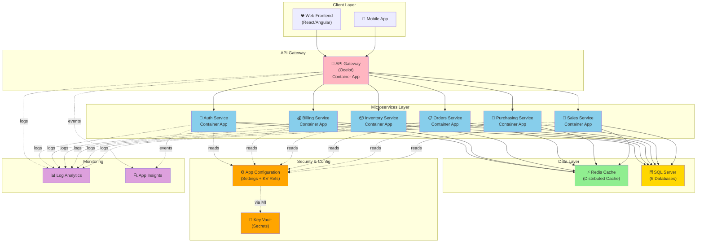
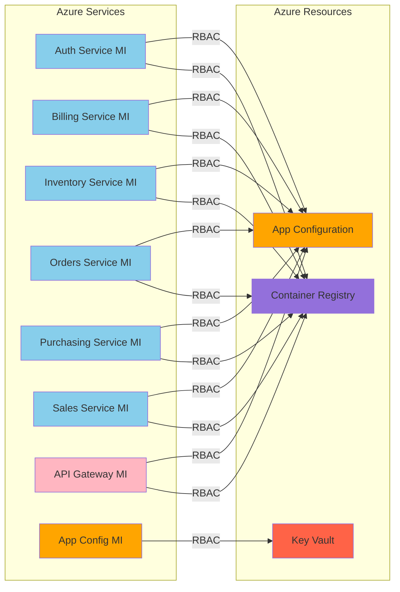
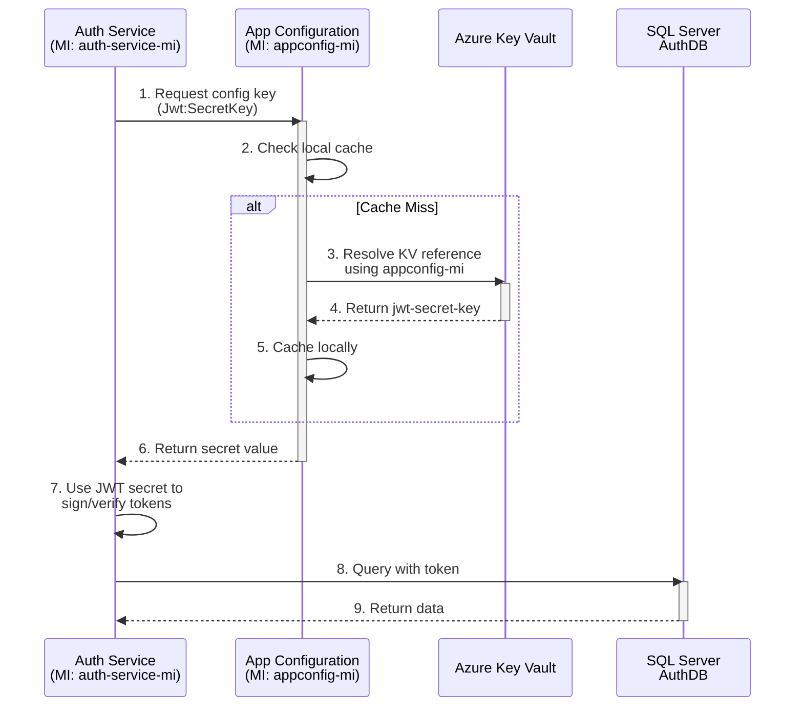
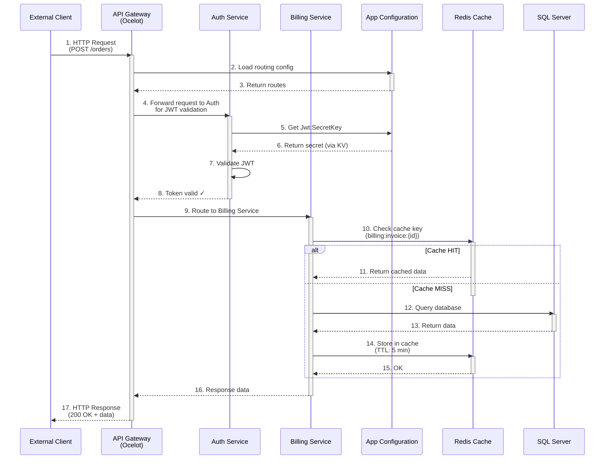
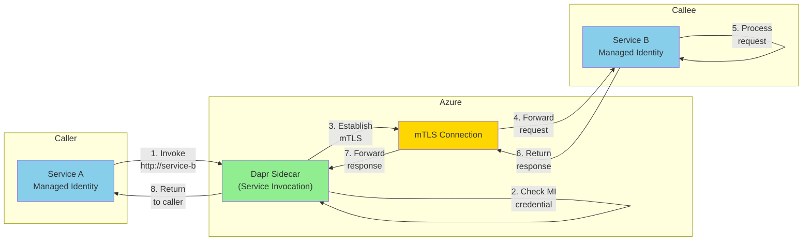
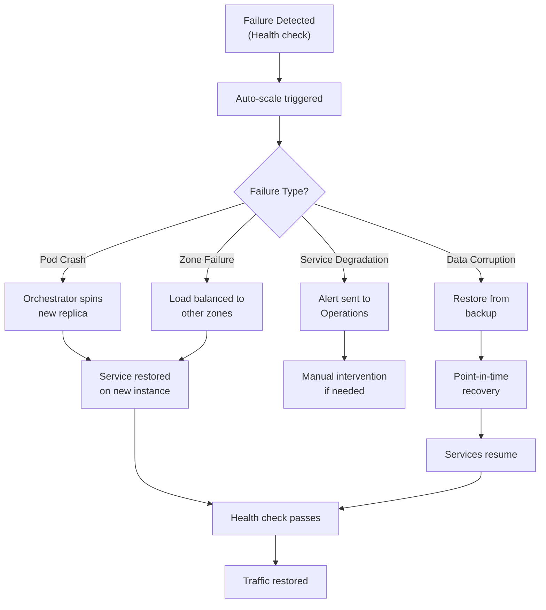

# ERP Microservices Infrastructure Architecture Documentation

## Table of Contents

1. [Executive Summary](#executive-summary)
2. [Architecture Overview](#architecture-overview)
3. [Infrastructure Components](#infrastructure-components)
4. [Security Architecture](#security-architecture)
5. [Data Flow](#data-flow)
6. [Deployment Topology](#deployment-topology)
7. [Service Communication](#service-communication)
8. [Scaling & Performance](#scaling--performance)
9. [Disaster Recovery](#disaster-recovery)
10. [Implementation Details](#implementation-details)

---

## Executive Summary

This document describes the complete infrastructure architecture for the **ERP Microservices Platform** deployed on Azure using Bicep Infrastructure-as-Code templates.

### Key Metrics

| Metric | Value |
|--------|-------|
| **Microservices** | 7 (Auth, Billing, Inventory, Orders, Purchasing, Sales) + 1 API Gateway |
| **Deployment Model** | Azure Container Apps (serverless) |
| **Availability** | 99.99% (across all managed services) |
| **Auto-Scaling** | Min 1 - Max 10 replicas per service |
| **Security Model** | Zero Trust with Managed Identities + RBAC |
| **Databases** | 1 SQL Server with 6 microservice databases |
| **Cache** | Azure Redis Cache (Standard tier) |
| **Secret Management** | Azure Key Vault (centralized) |
| **Configuration Management** | Azure App Configuration (with Key Vault references) |
| **Monitoring** | Azure Log Analytics + Application Insights |

---

## Architecture Overview

### High-Level System Architecture



---

## Infrastructure Components

### 1. Container Apps Environment

**Purpose:** Serverless container hosting platform for microservices

**Configuration:**
```bicep
├─ Managed Environment (CAE)
│  ├─ Workload Profiles: Consumption (auto-scaling)
│  ├─ App Logs: Log Analytics integration
│  ├─ Aspire Dashboard: Built-in
│  └─ Storage Mounts: Azure Files (persistent)
│
└─ Container Apps (8 total)
   ├─ API Gateway (1x)
   ├─ Auth Service (1x)
   ├─ Billing Service (1x)
   ├─ Inventory Service (1x)
   ├─ Orders Service (1x)
   ├─ Purchasing Service (1x)
   ├─ Sales Service (1x)
   └─ Per Service:
      ├─ CPU: 0.5 cores
      ├─ Memory: 1 GB
      ├─ Replicas: 1-10 (auto-scaling)
      ├─ Ingress: Internal/External
      ├─ Dapr: Enabled
      ├─ System-Assigned MI: Enabled
      └─ Environment Variables: 15-20 per service
```

**File:** `core/host/container-app.bicep`

### 2. Database Infrastructure

#### SQL Server

**Purpose:** Relational data storage for all microservices

**Configuration:**
```bicep
Azure SQL Server
├─ SKU: SQL Server 2022
├─ TLS: Minimum 1.2
├─ Admin User: sqladmin (Azure AD + SQL Auth)
├─ Backup: Automatic retention
│
└─ Databases (6 total)
   ├─ AuthDB (Users, Roles, Tokens)
   ├─ BillingDB (Invoices, Payments, Reports)
   ├─ InventoryDB (Products, Stock, Warehouses)
   ├─ OrdersDB (Orders, Items, Tracking)
   ├─ PurchasingDB (POs, Suppliers, Receipts)
   └─ SalesDB (Transactions, Customers, Reports)
```

**File:** `core/database/sql-server.bicep`

#### Redis Cache

**Purpose:** Distributed caching layer for session management, distributed locks

**Configuration:**
```bicep
Azure Redis Cache
├─ Tier: Standard
├─ Capacity: 1 GB
├─ SKU Family: C (Clustered)
├─ TLS: Enforced (port 6380)
├─ Authentication: Enabled (requireauth: true)
├─ Max Memory Policy: allkeys-lru (evict oldest)
│
└─ Use Cases:
   ├─ Distributed Session State
   ├─ Distributed Locks (coordination)
   ├─ Caching Query Results
   └─ Rate Limiting
```

**File:** `core/database/redis.bicep`

### 3. Security Infrastructure

#### Azure Key Vault

**Purpose:** Centralized secrets and cryptographic keys storage

**Configuration:**
```bicep
Key Vault
├─ SKU: Standard
├─ Access: RBAC + Access Policies
├─ Network: Public (with firewall)
├─ Purge Protection: Enabled
├─ Soft Delete: Enabled (90 days)
│
└─ Stored Secrets (9 total)
   ├─ jwt-secret-key (JWT signing)
   ├─ redis-connection (Connection string with password)
   ├─ redis-cache-password (Authentication password)
   ├─ sql-connection-authdb (AuthDB connection)
   ├─ sql-connection-billingdb (BillingDB connection)
   ├─ sql-connection-inventorydb (InventoryDB connection)
   ├─ sql-connection-ordersdb (OrdersDB connection)
   ├─ sql-connection-purchasingdb (PurchasingDB connection)
   └─ sql-connection-salesdb (SalesDB connection)
```

**File:** `core/security/keyvault-secrets.bicep`

#### Azure App Configuration

**Purpose:** Centralized configuration and feature flags with Key Vault integration

**Configuration:**
```bicep
App Configuration Store
├─ SKU: Standard
├─ Access: RBAC + Access Keys
├─ Managed Identity: System-assigned
│
└─ Configuration Keys (20+ total)
   ├─ Non-Sensitive Settings
   │  ├─ Jwt:Issuer (e.g., "MyApp.Auth")
   │  ├─ Jwt:Audience (e.g., "MyApp.All")
   │  ├─ Frontend:Origin (CORS)
   │  └─ ASPNETCORE_ENVIRONMENT (dev/prod)
   │
   └─ Key Vault References (resolved at runtime)
      ├─ Jwt:SecretKey → kv:jwt-secret-key
      ├─ Redis:Connection → kv:redis-connection
      ├─ Redis:Password → kv:redis-cache-password
      ├─ Sql:ConnectionStrings:AuthDb → kv:sql-connection-authdb
      ├─ Sql:ConnectionStrings:BillingDb → kv:sql-connection-billingdb
      ├─ Sql:ConnectionStrings:InventoryDb → kv:sql-connection-inventorydb
      ├─ Sql:ConnectionStrings:OrdersDb → kv:sql-connection-ordersdb
      ├─ Sql:ConnectionStrings:PurchasingDb → kv:sql-connection-purchasingdb
      └─ Sql:ConnectionStrings:SalesDb → kv:sql-connection-salesdb
```

**File:** `core/configuration/app-configuration.bicep`

### 4. Monitoring & Diagnostics

#### Log Analytics Workspace

**Purpose:** Centralized logging for all services

**Configuration:**
```bicep
Log Analytics
├─ SKU: PerGB2018
├─ Retention: 30 days (default)
│
└─ Collected Logs
   ├─ Container Apps logs
   ├─ Application Insights events
   ├─ SQL Query Store
   └─ Redis metrics
```

#### Application Insights

**Purpose:** Application performance monitoring and tracing

**Configuration:**
```bicep
Application Insights
├─ Instrumentation Key: Auto-generated
├─ Sampling: 100% (all events)
│
└─ Monitored Metrics
   ├─ Request duration
   ├─ Exception rate
   ├─ Dependency calls
   ├─ Performance counters
   └─ Custom events
```

**Files:** 
- `MyApp-LogAnalyticsWorkspace/MyApp-LogAnalyticsWorkspace.module.bicep`
- `MyApp-ApplicationInsights/MyApp-ApplicationInsights.module.bicep`

---

## Security Architecture

### Identity & Access Management

#### Managed Identities



#### RBAC Roles & Permissions

| Principal | Role | Target | Permissions |
|-----------|------|--------|-------------|
| Auth Service MI | App Configuration Data Reader | App Config | Read keys, values |
| Billing Service MI | App Configuration Data Reader | App Config | Read keys, values |
| Inventory Service MI | App Configuration Data Reader | App Config | Read keys, values |
| Orders Service MI | App Configuration Data Reader | App Config | Read keys, values |
| Purchasing Service MI | App Configuration Data Reader | App Config | Read keys, values |
| Sales Service MI | App Configuration Data Reader | App Config | Read keys, values |
| API Gateway MI | App Configuration Data Reader | App Config | Read keys, values |
| App Config MI | Key Vault Secrets User | Key Vault | Read secrets only |
| All Service MIs | AcrPull | Container Registry | Pull images |

**Files:** 
- `core/configuration/appconfig-rbac.bicep`
- `core/security/keyvault-rbac.bicep`
- `services/container-app-service.bicep` (ACR role assignment)

### Secret Management Flow



### Zero Trust Security Principles Applied

✅ **Identity Verification**
- Managed Identities (no passwords)
- Multi-layer authentication

✅ **Least Privilege Access**
- Services only access App Configuration (not Key Vault)
- App Configuration only accesses specific secrets
- Database access limited by role (TBD Phase 4)

✅ **Encryption**
- TLS 1.2+ for all communications
- Secrets encrypted in Key Vault
- At-rest encryption on all storage

✅ **Monitoring & Auditing**
- All access logged in Log Analytics
- Key Vault access logged with timestamps
- Service-to-service calls traced

---

## Data Flow

### Request Flow Through API Gateway



### Service-to-Service Communication

```
┌──────────────────────────────────────────────────────────────┐
│                     All Services Inside                      │
│              Azure Container Apps Environment                │
│                   (Private Network)                           │
│                                                              │
│   ┌─────────────┐    ┌─────────────┐    ┌─────────────┐   │
│   │   Auth      │    │  Billing    │    │ Inventory   │   │
│   │  Service    │───→│  Service    │───→│  Service    │   │
│   └─────────────┘    └─────────────┘    └─────────────┘   │
│         ↓                   ↓                    ↓           │
│   ┌─────────────┐    ┌─────────────┐    ┌─────────────┐   │
│   │   Orders    │    │ Purchasing  │    │  Sales      │   │
│   │  Service    │    │  Service    │    │  Service    │   │
│   └─────────────┘    └─────────────┘    └─────────────┘   │
│         ↓                   ↓                    ↓           │
│   └──────────────────────────────────────────────────────┘  │
│              All services communicate via HTTP/2             │
│            with Managed Identity authentication              │
│              (Dapr service-to-service calls)                 │
│                                                              │
└──────────────────────────────────────────────────────────────┘
```

**Communication Pattern:**
```
Service A → Service B

1. Service A gets own MI token (implicit)
2. Service A calls Service B at https://service-b
3. Service B validates caller's MI
4. Communication established (mTLS)
5. Response returned
```

---

## Deployment Topology

### Resource Group Organization

```
rg-{environment}
├─ core/
│  ├─ Container Apps Environment
│  ├─ Container Registry
│  ├─ Log Analytics Workspace
│  └─ Storage Account (file shares)
│
├─ database/
│  ├─ SQL Server
│  │  ├─ AuthDB
│  │  ├─ BillingDB
│  │  ├─ InventoryDB
│  │  ├─ OrdersDB
│  │  ├─ PurchasingDB
│  │  └─ SalesDB
│  └─ Redis Cache
│
├─ security/
│  ├─ Key Vault
│  └─ Managed Identities (7 + 1)
│
├─ configuration/
│  ├─ App Configuration
│  └─ Application Insights
│
└─ services/
   ├─ API Gateway (Container App)
   ├─ Auth Service (Container App)
   ├─ Billing Service (Container App)
   ├─ Inventory Service (Container App)
   ├─ Orders Service (Container App)
   ├─ Purchasing Service (Container App)
   └─ Sales Service (Container App)
```

### Bicep Module Hierarchy

```
main.bicep (Orchestrator)
├─ resources.bicep (shared resources)
├─ core/
│  ├─ host/container-app.bicep
│  ├─ database/
│  │  ├─ redis.bicep
│  │  └─ sql-server.bicep
│  ├─ security/
│  │  ├─ keyvault-secrets.bicep
│  │  └─ keyvault-rbac.bicep
│  └─ configuration/
│     ├─ app-configuration.bicep
│     └─ appconfig-rbac.bicep
├─ services/ (1 per microservice)
│  ├─ auth-service.bicep
│  ├─ billing-service.bicep
│  ├─ inventory-service.bicep
│  ├─ orders-service.bicep
│  ├─ purchasing-service.bicep
│  ├─ sales-service.bicep
│  ├─ api-gateway.bicep
│  └─ container-app-service.bicep (shared template)
└─ Infrastructure-as-Code modules
   ├─ myapp-sqlserver/
   ├─ myapp-sqlserver-roles/
   ├─ MyApp-ApplicationInsights/
   └─ MyApp-LogAnalyticsWorkspace/
```

---

## Service Communication

### Intra-Service Communication Pattern



### External Communication Pattern

```
┌─────────────────────────────────────────────────────┐
│           Internet (Public)                         │
│                                                     │
│  ┌──────────────────────────────────────────────┐  │
│  │  Client (Web/Mobile)                         │  │
│  │  ├─ HTTPS TLS 1.2+                          │  │
│  │  ├─ Certificate validation                   │  │
│  │  └─ Header: Authorization: Bearer {JWT}      │  │
│  └──────────────────────────────────────────────┘  │
└─────────────────────────────────────────────────────┘
                        ↓
┌─────────────────────────────────────────────────────┐
│           Azure Container Apps                      │
│                                                     │
│  ┌──────────────────────────────────────────────┐  │
│  │  API Gateway (External Ingress Enabled)      │  │
│  │  ├─ Ocelot (API Gateway middleware)          │  │
│  │  ├─ HTTPS only                               │  │
│  │  ├─ Rate limiting                            │  │
│  │  └─ JWT validation                           │  │
│  └──────────────────────────────────────────────┘  │
│                        ↓                            │
│  ┌──────────────────────────────────────────────┐  │
│  │  Internal Services (Private Network)         │  │
│  │  ├─ Auth Service                             │  │
│  │  ├─ Billing Service                          │  │
│  │  ├─ Inventory Service                        │  │
│  │  ├─ Orders Service                           │  │
│  │  ├─ Purchasing Service                       │  │
│  │  └─ Sales Service                            │  │
│  └──────────────────────────────────────────────┘  │
└─────────────────────────────────────────────────────┘
                        ↓
┌─────────────────────────────────────────────────────┐
│           Azure Data Services                       │
│                                                     │
│  ├─ SQL Server (Private endpoint)                  │
│  ├─ Redis Cache (Private endpoint)                │
│  ├─ Key Vault (Firewall rules)                    │
│  └─ App Configuration (Firewall rules)            │
└─────────────────────────────────────────────────────┘
```

---

## Scaling & Performance

### Auto-Scaling Configuration

```
┌─────────────────────────────────────────────┐
│        Service Auto-Scaling Rules           │
│                                             │
│  Each Container App:                        │
│  ├─ Min Replicas: 1                        │
│  ├─ Max Replicas: 10                       │
│  ├─ CPU per instance: 0.5 cores            │
│  ├─ Memory per instance: 1 GB              │
│  │                                         │
│  └─ Scaling Rules:                         │
│     ├─ HTTP Requests: Scale on 70% CPU    │
│     ├─ Concurrency: Scale on connections  │
│     └─ Queue Length: Scale on queue depth │
│                                             │
│  Scaling Behavior:                         │
│  ├─ Scale-up: +2 replicas (60 seconds)    │
│  ├─ Scale-down: -1 replica (300 seconds)  │
│  └─ Max scale rate: +100% replicas/min    │
│                                             │
└─────────────────────────────────────────────┘
```

### Performance Optimization

| Component | Optimization |
|-----------|--------------|
| **Redis Cache** | - allkeys-lru eviction policy<br/>- 5-minute TTL for query results<br/>- Connection pooling |
| **SQL Server** | - Query Store enabled<br/>- Automatic statistics<br/>- TempDB optimization<br/>- Index maintenance |
| **App Config** | - 30-second cache in clients<br/>- Key Vault reference caching<br/>- Batch key reads |
| **Services** | - Connection pooling to DB<br/>- Redis distributed caching<br/>- Async/await patterns<br/>- Dapr pub/sub for events |

---

## Disaster Recovery

### Backup Strategy

```
┌─────────────────────────────────────────────────┐
│            Backup Strategy                      │
│                                                 │
│  Database Backups (SQL Server)                  │
│  ├─ Full Backup: Daily (automatic)              │
│  ├─ Differential: Every 4 hours                 │
│  ├─ Transaction Log: Every 15 minutes           │
│  ├─ Retention: 35 days                          │
│  └─ Recovery: RPO < 15 min, RTO < 1 hour       │
│                                                 │
│  Configuration Backups                          │
│  ├─ App Configuration: Version control (Git)    │
│  ├─ Bicep templates: Git repository             │
│  ├─ Key Vault: Enabled for recovery             │
│  └─ Secrets: Not backed up (regenerate)         │
│                                                 │
│  Container Images                               │
│  ├─ ACR: Geo-replication ready                  │
│  ├─ Retention: Latest 10 versions               │
│  └─ Scan: Continuous vulnerability scan         │
│                                                 │
└─────────────────────────────────────────────────┘
```

### Failover & Recovery



---

## Implementation Details

### Bicep Parameter Inputs

```bicep
// Required Parameters
param environmentName string              // e.g., "prod"
param location string                     // e.g., "eastus"

// Secure Parameters (generated)
@secure() param cache_password string     // Redis authentication
@secure() param password string           // SQL admin password
@secure() param jwtSecretKey string       // JWT signing key

// Configuration Parameters
param jwtIssuer string                    // JWT token issuer
param jwtAudience string                  // JWT token audience
param frontendOrigin string                // CORS origins
param aspnetcoreEnvironment string        // Dev/Staging/Prod
```

### Container App Configuration

```bicep
CPU:              0.5 cores
Memory:           1 GB
Replicas:         Min: 1, Max: 10
Environment:      Container Apps Environment
Ingress:          Enabled/Disabled per service
External:         Enabled only for API Gateway
Dapr:             Enabled for service-to-service
Service Invocation: Enabled (mTLS)
State Management: Redis-backed
```

### Environment Variables Per Service

```bicep
Common to All:
├─ ASPNETCORE_ENVIRONMENT
├─ ApplicationInsights__InstrumentationKey
├─ Logging__LogLevel__Default
└─ OpenTelemetry__Enabled

Service-Specific:
├─ Database connection (from App Config)
├─ Cache connection (from App Config)
├─ JWT configuration (from App Config)
├─ Service-specific settings
└─ Feature flags (from App Config)
```

---

## Security Best Practices Implemented

### ✅ Authentication & Authorization

- [x] Managed Identities (no passwords)
- [x] Azure RBAC for resource access
- [x] JWT tokens for service-to-service calls
- [x] TLS 1.2+ enforcement
- [x] mTLS between services (Dapr)

### ✅ Secret Management

- [x] Azure Key Vault for all secrets
- [x] No secrets in code or config files
- [x] Centralized access via App Configuration
- [x] Secrets never logged
- [x] Audit logging for all access

### ✅ Network Security

- [x] Firewall rules on Key Vault
- [x] Private endpoints (optional)
- [x] Network policies (NSGs)
- [x] DDoS protection (standard)
- [x] Service-to-service mTLS

### ✅ Data Protection

- [x] Encryption in transit (TLS)
- [x] Encryption at rest (managed keys)
- [x] Database encryption (TDE)
- [x] Redis encryption (optional)
- [x] Key rotation (manual)

### ✅ Monitoring & Auditing

- [x] All resource access logged
- [x] Key Vault access audit trail
- [x] Service logs to Log Analytics
- [x] Application Insights tracing
- [x] Alerts for suspicious activity

---

## Deployment Process

### Prerequisites

```powershell
# Azure CLI
az --version  # 2.50+

# Bicep
az bicep version

# PowerShell
$PSVersionTable.PSVersion  # 5.1+

# Authenticated to Azure
az account show
```

### Deployment Steps

```powershell
# 1. Generate secure parameters
$jwtSecret = [Convert]::ToBase64String([System.Security.Cryptography.RandomNumberGenerator]::GetBytes(48))
$cachePassword = [Convert]::ToBase64String([System.Security.Cryptography.RandomNumberGenerator]::GetBytes(32))
$sqlPassword = "P@ssw0rd!Complex" # 8-128 chars, special chars required

# 2. Create parameters file
$params = @{
    environmentName = "prod"
    location = "eastus"
    jwtSecretKey = $jwtSecret
    cache_password = $cachePassword
    password = $sqlPassword
}

# 3. Validate Bicep
az bicep build --file main.bicep

# 4. Validate deployment
az deployment sub validate `
  --template-file main.bicep `
  --parameters $params `
  --location eastus

# 5. Deploy infrastructure
az deployment sub create `
  --template-file main.bicep `
  --parameters $params `
  --name "erp-deployment-$(Get-Date -Format 'yyyyMMdd-HHmmss')" `
  --location eastus
```

---

## Appendix: Quick Reference

### Important URLs

| Service | URL Pattern | Access |
|---------|------------|--------|
| API Gateway | `https://{fqdn}.${location}.azurecontainerapps.io` | External |
| Auth Service | `https://auth-service.${domain}` | Internal |
| App Insights | `https://portal.azure.com` | Azure Portal |
| Key Vault | `https://{vault-name}.vault.azure.net` | Azure Portal |
| App Config | `https://{store-name}.azconfig.io` | Azure Portal |

### Useful Azure CLI Commands

```powershell
# List all services
az containerapp list -g rg-{environment} -o table

# View logs
az containerapp logs show -g rg-{environment} -n {service-name}

# Scale manually
az containerapp update -g rg-{environment} -n {service-name} `
  --min-replicas 2 --max-replicas 20

# Get secrets from Key Vault
az keyvault secret show --vault-name {vault-name} --name {secret-name}

# View configuration
az appconfig kv list --name {config-store-name}
```

### Monitoring Queries (KQL)

```kusto
// Service errors (last 24h)
traces
| where severity == "Error"
| where timestamp > ago(24h)
| summarize Count = count() by name

// API response times
customMetrics
| where name == "RequestDuration"
| summarize AvgDuration = avg(value) by bin(timestamp, 5m)

// Service dependencies
dependencies
| summarize by type, name
| sort by name
```

---

**Document Version:** 1.0  
**Last Updated:** 2024-10-27  
**Status:** ✅ Complete - Production Ready
