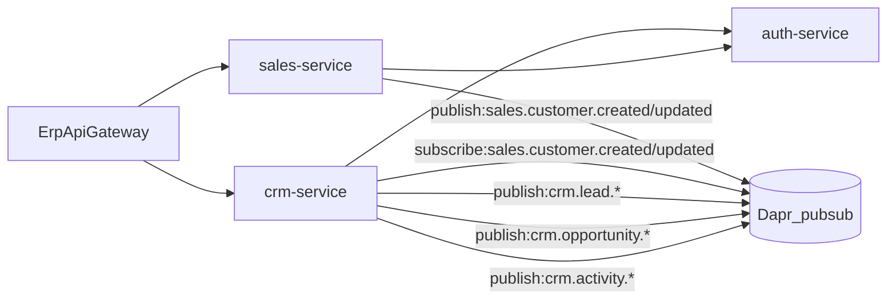

# CRM Architecture

## High-level integration

## Notes
- Customers remain canonical in **Sales**; CRM references `CustomerId`.
- CRM publishes domain events via Dapr `pubsub` for downstream automation (notifications/workflow can be added later without changing CRM endpoints).

